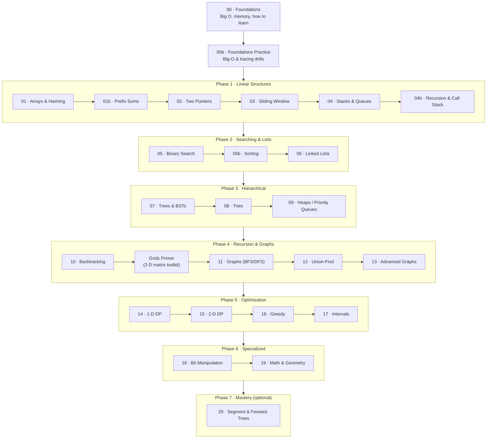

# 🚀 The DSA Roadmap — From Zero to Advanced

Welcome. This is a self-paced course that takes you from *"what even is a data structure?"* to confidently solving hard algorithm problems. Each stop has a **lesson** (concept + pattern + diagrams), a **code template** to internalize, and a **curated problem set** to drill.

> **New here?** Start with [**Lesson 00 — Foundations**](learning/00-foundations.md). It assumes zero CS background.

## 📖 How to use this path

1. **Read the lesson** for a topic — the concept, the pattern, the worked traces.
2. **Study the [template](appendix/templates/)** — type the reusable code shape from memory.
3. **Drill problems** from the linked section of [`recommended.md`](../lists/recommended.md), easy → hard.
4. **Check yourself** with the 3 boxes at the end of each lesson before advancing.

**Three rules:** don't jump around (DSA is cumulative) · follow the **30-minute rule** (stuck 30 min → read the hints) · **review** each topic ~3 days later.

**Difficulty legend:** 🟢 Easy · 🟡 Medium · 🔴 Hard

## 🗺 The path at a glance

## 🛤 The lessons

### Phase 0 — Foundations
| # | Lesson | Why it matters |
|---|--------|----------------|
| 00 | [Foundations](learning/00-foundations.md) | What data structures & algorithms *are*, Big O, and how to use this repo. |
| 00b | [Foundations Practice](learning/00b-foundations-practice.md) | Big-O & code-tracing drills, amortized analysis — make Phase 0 stick before Lesson 01. |

### Phase 1 — Linear Structures *(the building blocks)*
| # | Lesson | One-line idea | Practice |
|---|--------|---------------|----------|
| 01 | [Arrays & Hashing](learning/01-arrays-hashing.md) | Trade memory for O(1) lookups; kill brute-force double loops. | [→](../lists/recommended.md#1-arrays--hashing-24-problems) |
| 01b | [Prefix Sums](learning/01b-prefix-sums.md) | Precompute once, range queries in O(1); subarray sum = k in O(n). | woven into 03/15 |
| 02 | [Two Pointers](learning/02-two-pointers.md) | Two cursors on a sorted array drop the O(n²). | [→](../lists/recommended.md#2-two-pointers-14-problems) |
| 03 | [Sliding Window](learning/03-sliding-window.md) | A moving boundary over contiguous ranges; O(n). | [→](../lists/recommended.md#3-sliding-window-14-problems) |
| 04 | [Stacks & Queues](learning/04-stack.md) | LIFO/FIFO for order-sensitive work; monotonic stack for next-greater. | [→](../lists/recommended.md#4-stack-16-problems) |
| 04b | [Recursion & the Call Stack](learning/04b-recursion.md) | Base case + recursive case; the call stack *is* a stack. The bridge to trees, backtracking & DP. | woven into 07/10/14 |

### Phase 2 — Searching & Lists
| # | Lesson | One-line idea | Practice |
|---|--------|---------------|----------|
| 05 | [Binary Search](learning/05-binary-search.md) | Halve any ordered search space — including the answer. | [→](../lists/recommended.md#5-binary-search-18-problems) |
| 05b | [Sorting](learning/05b-sorting.md) | How `sorted()` actually works: merge/quick sort, the n·log n floor, stability. | woven into 16/17 |
| 06 | [Linked Lists](learning/06-linked-list.md) | Pointer surgery: reverse, dummy head, fast/slow. | [→](../lists/recommended.md#6-linked-list-20-problems) |

### Phase 3 — Hierarchical Structures
| # | Lesson | One-line idea | Practice |
|---|--------|---------------|----------|
| 07 | [Trees & BSTs](learning/07-trees.md) | DFS base→recurse→combine, or BFS level-by-level. | [→](../lists/recommended.md#7-trees-29-problems) |
| 08 | [Tries](learning/08-tries.md) | Prefix trees: O(k) prefix queries. | [→](../lists/recommended.md#10-tries-6-problems) |
| 09 | [Heaps / Priority Queues](learning/09-heap-priority-queue.md) | The always-available extreme element; top-K & streaming. | [→](../lists/recommended.md#8-heap--priority-queue-14-problems) |

### Phase 4 — Recursion & Graphs
| # | Lesson | One-line idea | Practice |
|---|--------|---------------|----------|
| 10 | [Backtracking](learning/10-backtracking.md) | Choose → explore → un-choose over partial solutions. | [→](../lists/recommended.md#9-backtracking-16-problems) |
| — | [Grids Primer](learning/10b-grids-primer.md) | The 2-D matrix toolkit — indexing, 4-neighbors, bounds, visited. Read before grid problems. | woven into 11/15/19 |
| 11 | [Graphs (BFS/DFS)](learning/11-graphs.md) | BFS for shortest unweighted paths, DFS for connectivity. | [→](../lists/recommended.md#11-graphs-23-problems) |
| 12 | [Union-Find](learning/12-union-find.md) | Near-O(1) connectivity and cycle detection under merges. | [→](../lists/recommended.md#11-graphs-23-problems) |
| 13 | [Advanced Graphs](learning/13-advanced-graphs.md) | Weighted shortest paths (Dijkstra), ordering (topo sort). | [→](../lists/recommended.md#12-advanced-graphs-11-problems) |

### Phase 5 — Optimization
| # | Lesson | One-line idea | Practice |
|---|--------|---------------|----------|
| 14 | [1-D Dynamic Programming](learning/14-dp-1d.md) | State + transition + base case over one axis. | [→](../lists/recommended.md#13-1-d-dynamic-programming-22-problems) |
| 15 | [2-D Dynamic Programming](learning/15-dp-2d.md) | Same engine, two indices: grids and sequence pairs. | [→](../lists/recommended.md#14-2-d-dynamic-programming-20-problems) |
| 16 | [Greedy](learning/16-greedy.md) | Take the locally best choice; the proof is the hard part. | [→](../lists/recommended.md#15-greedy-14-problems) |
| 17 | [Intervals](learning/17-intervals.md) | Sort first, then one linear sweep to merge / count. | [→](../lists/recommended.md#16-intervals-10-problems) |

### Phase 6 — Specialized
| # | Lesson | One-line idea | Practice |
|---|--------|---------------|----------|
| 18 | [Bit Manipulation](learning/18-bit-manipulation.md) | Masks, shifts, and XOR cancellation in O(1). | [→](../lists/recommended.md#18-bit-manipulation-13-problems) |
| 19 | [Math & Geometry](learning/19-math-geometry.md) | GCD, fast power, in-place matrix transforms. | [→](../lists/recommended.md#17-math--geometry-16-problems) |

### Phase 7 — Mastery Track *(optional — for hard-level & competitive programming)*
| # | Lesson | One-line idea | Practice |
|---|--------|---------------|----------|
| 20 | [Segment Trees & Fenwick Trees](learning/20-segment-trees.md) | Range queries + point updates in O(log n). The upgrade from prefix sums when the array changes. | LC 307, 315, 493 |

## 🎚 Choosing a track

- **In a hurry / interview next week?** Do the lessons but practice from [Rushed 40](../lists/rushed40.md) or [Blind 75](../lists/neetcodeblind75.md).
- **Building solid fundamentals?** Follow this roadmap straight through with [Recommended 300](../lists/recommended.md).
- **Completionist?** Pair each lesson with the full [NeetCode 250](../lists/neetcode250.md).

## 📚 Appendix

Quick-reference material that supports the lessons:

- [Review schedule](review-schedule.md) — spaced-repetition table + per-phase milestone checkpoints
- [Python syntax for interviews](appendix/python-syntax.md)
- [Core cheatsheet](appendix/cheatsheet-core.md) — arrays, strings, dicts, trees, graphs
- [Advanced patterns cheatsheet](appendix/cheatsheet-advanced.md)
- [Code templates](appendix/templates/) — one reusable skeleton per pattern

---

*Categories follow the NeetCode 150/250 taxonomy. Practice sets live in [`lists/`](../lists/); solutions in [`problems/`](../problems/).*
